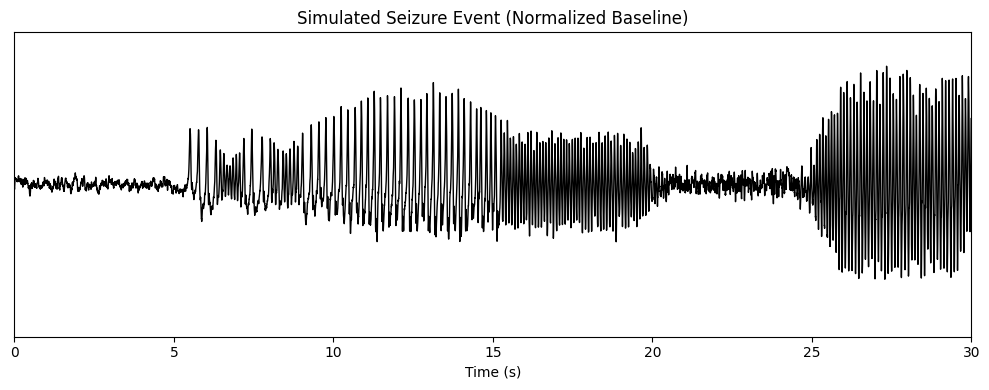

# Epilepsy Etiology: A Study on the Principles Leading to Seizure Events

This repository contains computational models for simulating neuronal activity in epileptic brain tissue, from single-neuron dynamics to population-level behavior. The project was developed as part of the exam of the Brain Modeling course during my Bachelor in Artificial Intelligence.

## Overview

The project implements two complementary approaches to modeling epileptic seizures:

1. **Microscale (single neuron)**: Hodgkin-Huxley model with pathological ion channel dynamics
2. **Mesoscale (neuronal populations)**: Wendling neural mass model for local field potentials


*Simulated 30-second epileptic seizure event showing smooth transitions through different neuronal states*

## Models implemented

### Hodgkin-Huxley Model

Classic conductance-based model for neuronal action potentials with extensions for seizure-like activity:
- Normal spiking behavior with external current injection
- Pathological activity through time-varying Na⁺ and K⁺ conductances
- Smooth transitions from normal to seizure states using sigmoid functions

### Wendling Neural Mass Model

Population-level model simulating interactions between pyramidal cells and inhibitory interneurons:
- Three neuronal populations (pyramidal, slow inhibitory, fast inhibitory)
- Six distinct epileptic states from background to full ictal activity
- Realistic local field potential (LFP) generation

## Installation

### Requirements

- Python 3.7+
- NumPy
- SciPy
- Matplotlib

See requirements.txt for specific versions.

### Setup

```bash
# clone the repository
git clone https://github.com/sebaleye/epilepsy_etiology.git
cd epilepsy_etiology

# install dependencies
pip install -r requirements.txt
```

## Usage

### Running simulations

Each example script can be run independently:

```bash
# Hodgkin-Huxley normal neuron
python examples/hh_normal.py

# Hodgkin-Huxley seizure simulation
python examples/hh_seizure.py

# Wendling basic LFP
python examples/wendling_basic.py

# six epileptic states
python examples/wendling_six_states.py

# complete seizure event
python examples/seizure_concatenation.py
```

### Using the models

```python
from src.models.hodgkin_huxley import HH_ode
from src.models.wendling import WendlingNMM
from src.utils.parameters import get_hh_params, get_wendling_params

# Hodgkin-Huxley simulation
config = get_hh_params()
# run simulation with scipy.integrate.solve_ivp

# Wendling simulation
P = get_wendling_params(A=4, B=15, G=22)
# run simulation with Euler integration
```

## Key parameters

### Wendling Model states

The model reproduces six distinct epileptic activity patterns:

| Type | A | B | G | Description |
|------|---|---|---|-------------|
| 1 | 3.0 | 26 | 10 | Background activity |
| 2 | 4.0 | 26 | 10 | Sporadic spikes |
| 3 | 5.0 | 22 | 10 | Rhythmic spikes |
| 4 | 4.0 | 15 | 22 | Slow quasi-sinusoidal |
| 5 | 6.5 | 10 | 22 | Low voltage rapid activity |
| 6 | 7.0 | 18 | 2 | Fast activity (ictal) |

Parameters:
- **A**: Excitatory synaptic gain
- **B**: Slow inhibitory synaptic gain
- **G**: Fast inhibitory synaptic gain

## References

This work is based on the following papers:

**Hodgkin, A. L., & Huxley, A. F. (1952).** A quantitative description of membrane current and its application to conduction and excitation in nerve. *The Journal of Physiology*, 117(4), 500-544.
DOI: [10.1113/jphysiol.1952.sp004764](https://doi.org/10.1113/jphysiol.1952.sp004764)

**Wendling, F., Bartolomei, F., Bellanger, J. J., & Chauvel, P. (2002).** Epileptic fast activity can be explained by a model of impaired GABAergic dendritic inhibition. *European Journal of Neuroscience*, 15(9), 1499-1508.
DOI: [10.1046/j.1460-9568.2002.01985.x](https://doi.org/10.1046/j.1460-9568.2002.01985.x)

## Methodology

### Hodgkin-Huxley Model
- Numerical integration: Runge-Kutta 4th order (RK45)
- Time step: Variable (adaptive)
- Simulation time: 120 ms

### Wendling Model
- Numerical integration: Euler method
- Sampling frequency: 512 Hz
- Time step: ~1.95 ms

## Acknowledgments

I would like to highlight the importance of the seminal papers by Wendling et al. (2002) and Hodgkin & Huxley (1952), fundamental contributions to computational neuroscience and epilepsy research.

## Project group members

<div align="center"> <table> <tr> <td align="center"> <a href="https://github.com/PietroSaveri"> <br /> <sub><b>Pietro Saveri</b></sub> </a> </td> <td align="center"> <a href="https://github.com/sebaleye"> <br /> <sub><b>Sebastiano Pietrasanta</b></sub> </a> </td> <td align="center"> <a href="https://github.com/M4tteoo"> <br /> <sub><b>Matteo Salami</b></sub> </a> </td> </tr> </table> </div>